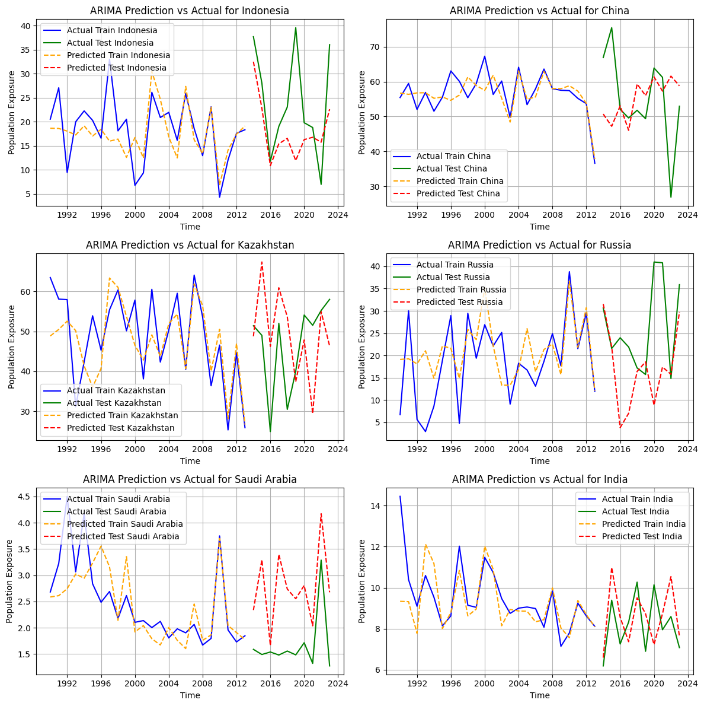

# Mitigasi Risiko Paparan Panas Ekstrem melalui Pemanfaatan Hutan dan Transisi Energi Terbarukan di Asia

Project ini dibuat untuk tugas final project MSIB Data Science di Startup Campus

## Problem Statement
Selama periode 1990-2021, paparan suhu panas ekstrem di negara-negara Asia menjadi masalah yang semakin mendesak. Project ini berfokus pada 6 negara di Asia yaitu Arab Saudi, China, India, Indonesia, Kazakhstan, dan Russia dalam menganalisis emisi CO2 berbasis produksi, tingkat pasokan energi terbarukan, dan luas hutan dapat berpengaruh terhadap tingkat paparan panas yang dirasakan oleh populasi di Asia. Negara dengan emisi CO2 tinggi dan rendahnya penggunaan energi terbarukan mungkin menghadapi risiko yang lebih besar terhadap paparan suhu ekstrem. Selain itu, luas hutan yang terbatas juga bisa memperburuk dampak perubahan iklim, yang meningkatkan kerentanannya terhadap cuaca ekstrem.

## Goals
Project ini memiliki tujuan: 
1. Menganalisis tren panas ekstrem di kawasan Asia 
2. Memahami hubungan antara populasi, emisi CO2, energi terbarukan, dan luas hutan di suatu negara 
3. Memberikan rekomendasi berbasis data untuk mengurangi dampak panas ekstrem dan mendukung mitigasi perubahan iklim	

## Dataset
Dataset utama yang digunakan dalam project ini diambil dari https://data-explorer.oecd.org/, dengan cakupan data dari tahun 1990 - 2021. Analisis ini difokuskan pada enam negara di Asia yaitu Arab Saudi, China, India, Indonesia, Kazakhstan, dan Russia.

## Dashboard Link
https://public.tableau.com/views/RealDasboardEurekaFinalProject/China?:language=en-US&publish=yes&:sid=&:redirect=auth&:display_count=n&:origin=viz_share_link

## Data Dictionary
1.	*Population Heat Exposure*: Jumlah rata-rata paparan penduduk terhadap hari dengan suhu ekstrem.
3.	*Production-based CO2 Emissions*: Total emisi CO2 berbasis produksi dalam satuan ton.
4.	*Renewable Energy Supply*: Total pasokan energi yang berasal dari sumber terbarukan, seperti angin, matahari, hidro, dan biomassa.
5.	*Forest*: Luas total hutan di suatu wilayah yang berperan dalam penyerapan CO2 dan mitigasi perubahan iklim.
6.	*Population*: Jumlah total populasi di suatu negara.

## Data Preprocessing
1.	Kami melakukan pengecekan pada missing value dan menemukan bahwa terdapat tiga kolom yang memiliki nilai kosong, yaitu: Production-based CO2 Emissions dengan 12 nilai kosong, Renewable Energy Supply dengan 5 nilai kosong, dan Forest dengan 10 nilai kosong. Untuk mengatasi masalah ini, kami menggunakan metode forward fill dan backward fill guna melengkapi data yang hilang agar data tetap konsisten dan dapat dianalisis dengan baik.
2.	Kami melakukan pengecekan pada duplikat data dan tidak menemukan adanya data duplikat.
3.	Kami melakukan pengecekan terhadap outlier dan menemukan beberapa variabel yang mengandung outlier. Namun, kami memutuskan untuk tidak menanganinya, karena dalam metode time series forecasting, outlier tidak perlu diatasi, mengingat data berbasis waktu memiliki peran yang penting dalam analisis dan prediksi.
4.	Kami melakukan pengecekan terhadap imbalance data pada kolom nation dan menemukan bahwa setiap negara (China, India, Indonesia, Kazakhstan, Russia, dan Saudi Arabia) muncul sebanyak 34 kali. Hal ini menunjukkan bahwa jumlah data untuk masing-masing kategori adalah seimbang dan nilai imbalance antara kategori adalah 0, yang berarti tidak ada ketidakseimbangan antar kategori dalam kolom nation.

## Explanatory Data Analysis (EDA)
### 1.	Korelasi antar feature

 
 
Insight:
Terdapat korelasi yang kuat antara populasi dan energi terbarukan (0.96), menunjukkan bahwa pertumbuhan populasi mendorong peningkatan pemanfaatan energi terbarukan. Namun, populasi juga memiliki korelasi positif dengan emisi CO2 (0.69), yang mengindikasikan peningkatan aktivitas manusia turut menyumbang emisi karbon. Di sisi lain, luas hutan memiliki korelasi negatif dengan populasi (-0.10) dan energi terbarukan (-0.07). Selain itu, heat exposure memiliki hubungan positif sedang dengan emisi CO2 (0.46) dan populasi (0.25), yang menggambarkan bahwa peningkatan emisi karbon dioksida dan pertumbuhan populasi dapat memengaruhi peningkatan suhu lingkungan.
Secara keseluruhan, hasil ini menekankan pentingnya pengendalian emisi CO2 dan pelestarian hutan sebagai upaya untuk meminimalkan dampak perubahan iklim di tengah pertumbuhan populasi yang terus meningkat.

### 2.	Feature Engineering
a.	Membuat feature population exposure
Menghitung jumlah populasi yang terekspos pada hari panas
b.	Membuat feature exposure rate
Membuat fungsi ‘kategori_paparan’ berdasarkan persentase paparan panas
•	Jika persentase paparan < 25% = ‘Low’
•	Jika 25% <= % paparan <= 75% = ‘Moderate’
•	Jika persentase paparan > 75% = ‘High’

## 3.	Data Visualization
### a.	Tren paparan panas tiap negara
 
 
 
### b.	Rata-rata paparan panas setiap negara

  
  
## Model Selection and Analysis
### a.	Double Exponential Smoothing
 
 
  
Secara umum, visualisasi ini menunjukkan seberapa baik model Double Exponential Smoothing mampu menangkap pola dalam data historis dan memprediksi nilai di masa depan. Beberapa poin penting yang dapat kita amati:
•	Kemampuan Model dalam Menangkap Pola:
o	Pola Musiman: Beberapa negara menunjukkan pola musiman yang jelas, seperti fluktuasi tahunan. Model DES umumnya cukup baik dalam menangkap pola musiman ini.
o	Tren: Beberapa negara menunjukkan tren kenaikan atau penurunan jangka panjang. Model Double Exponential Smoothing juga dapat menangkap tren ini, meskipun mungkin tidak selalu sempurna.
•	Akurasi Prediksi:
o	Data Latih: Prediksi pada data latih umumnya cukup akurat, menunjukkan bahwa model telah "memahami" data dengan baik.
o	Data Uji: Akurasi pada data uji bervariasi antar negara. Beberapa negara menunjukkan prediksi yang cukup akurat, sementara yang lain memiliki kesalahan yang lebih besar.

### b.	Triple Exponential Smoothing
 
  
  
Secara keseluruhan, model Tripple Exponensial Smooting terlihat mampu menangkap pola umum dalam data, terutama tren dan musim. Namun, tingkat akurasi prediksi bervariasi antar negara. Beberapa hal yang bisa kita amati:
•	Kemampuan Menangkap Tren: 
Model umumnya dapat mengikuti tren kenaikan atau penurunan yang terjadi pada data. 
•	Kemampuan Menangkap Musim: 
Untuk negara-negara dengan pola musiman yang jelas, model juga mampu menangkap fluktuasi musiman tersebut. 
•	Akurasi Prediksi: 
a.	Data Latih: Prediksi pada data latih umumnya cukup baik, menunjukkan bahwa model telah "belajar" dengan baik dari data historis. 
b.	Data Uji: Akurasi pada data uji lebih bervariasi. Beberapa negara menunjukkan prediksi yang cukup akurat, sementara yang lain memiliki kesalahan yang lebih besar.

### c.	ARIMA

Secara keseluruhan, model ARIMA terlihat mampu menangkap pola umum dalam data, terutama tren dan musim. Namun, tingkat akurasi prediksi bervariasi antar negara. Beberapa hal yang bisa kita amati:
•	Kemampuan Menangkap Tren: 
Model umumnya dapat mengikuti tren kenaikan atau penurunan yang terjadi pada data. 
•	Kemampuan Menangkap Musim: 
Untuk negara-negara dengan pola musiman yang jelas, model juga mampu menangkap fluktuasi musiman tersebut. 
•	Akurasi Prediksi: 
a.	Data Latih: Prediksi pada data latih umumnya cukup baik, menunjukkan bahwa model telah "belajar" dengan baik dari data historis. 
b.	Data Uji: Akurasi pada data uji lebih bervariasi. Beberapa negara menunjukkan prediksi yang cukup akurat seperti Cihina dan Indonesia, sementara yang lain memiliki kesalahan yang lebih besar.

## Metric Evaluation

Alasan utama kami memilih kedua metrik ini adalah: RMSE menunjukkan kesalahan dalam angka, sedangkan MAPE menunjukkan kesalahan dalam persentase sehingga keduanya saling melengkapi dan dapat dengan mudah dipahami.
Hasil evaluasi menunjukkan bahwa model ARIMA memiliki performa terbaik dengan RMSE dan MAPE terendah di sebagian besar negara, seperti Indonesia (RMSE: 10.72, MAPE: 0.35) China (RMSE: 15.6178 MAPE: 0,2493) dan India (RMSE: 1.50, MAPE: 0.16). Model ini unggul dibandingkan Double dan Triple Exponential Smoothing.
Negara China yang telah diberi warna hijau menandakan bahwa untuk selanjutnya tim kami akan berfokus pada negara China dalam pemodelan ini.

## Forecasting

 
Menurut prediksi menggunakan model ARIMA, paparan panas di China akan meningkat di tahun 2025 kemudian menurun selama 10 tahun ke depan (2024 - 2034).

## Business Solution
### 1.	Pengurangan Emisi CO2
Dorong penggunaan teknologi ramah lingkungan dan kurangi ketergantungan pada bahan bakar fosil. Pemerintah dan perusahaan dapat berinvestasi dalam teknologi rendah emisi seperti kendaraan listrik dan serta menerapkan pajak karbon untuk mengurangi emisi gas rumah kaca.

### 2.	Transisi ke Energi Terbarukan
Tingkatkan penggunaan sumber energi terbarukan seperti tenaga surya, angin, dan air. Pemerintah dapat memberikan insentif bagi masyarakat dan bisnis yang menggunakan energi hijau serta mendanai pembangunan infrastruktur energi terbarukan.
### 3.	Rehabilitasi Hutan
Hentikan deforestasi dengan memperketat regulasi penggunaan lahan. Lakukan reboisasi dan rehabilitasi hutan untuk menjaga keseimbangan ekosistem karena hutan dapat menyerap CO2 dan mengurangi panas di wilayah sekitarnya.

